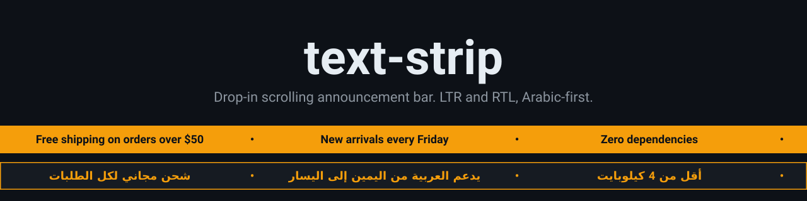
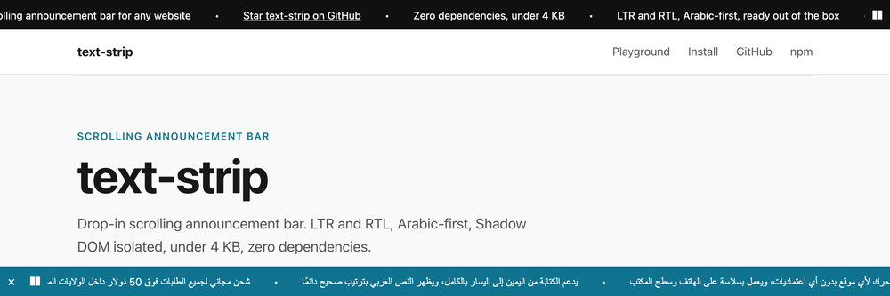

<p align="center">
  
</p>

<p align="center">
  
</p>

<p align="center">
  <a href="https://www.npmjs.com/package/text-strip"></a>
  <a href="https://github.com/mo-hawary/text-strip/actions/workflows/ci.yml"></a>
  <a href="https://bundlejs.com/?q=text-strip"></a>
  <a href="https://www.npmjs.com/package/text-strip?activeTab=dependencies"></a>
  <a href="./src/options.ts"></a>
  <a href="README.md#rtl-and-bidi-notes"></a>
  <a href="README.md#accessibility"></a>
  <a href="./LICENSE"></a>
</p>

<p align="center">
  <a href="https://mo-hawary.github.io/text-strip/"><strong>العرض المباشر</strong></a> &nbsp;·&nbsp;
  <a href="README.md"><strong>English</strong></a> &nbsp;·&nbsp;
  <a href="./CHANGELOG.md"><strong>سجل التغييرات</strong></a> &nbsp;·&nbsp;
  <a href="./CONTRIBUTING.md"><strong>المساهمة</strong></a> &nbsp;·&nbsp;
  <a href="./SECURITY.md"><strong>الأمان</strong></a>
</p>

<p align="center">
  
</p>

---

<div dir="rtl">

## لماذا text-strip؟

يحتاج المتجر إلى شريط "شحن مجاني" بالعربية والإنجليزية، دون تطبيق جديد، ودون إعادة كتابة القالب، ودون ودجت يتعارض مع تنسيقات الموقع. text-strip ملف واحد وكائن إعدادات واحد. يرسم الشريط داخل Shadow DOM، ويحدد اتجاهه من النص، ولا يغيّر شيئاً آخر في الصفحة.

- **كائن إعدادات واحد.** مرّر قائمة النصوص وبعض الخيارات. الاستدعاء نفسه يعمل مع bundler أو مع وسم `<script>` عادي، وفي Shopify وWordPress.
- **RTL أولاً بالعربية.** القيمة `dir: 'auto'` تقرأ أول حرف له اتجاه واضح وتختار اتجاه الحركة. كل عنصر معزول لخوارزمية bidi، فتحافظ العناصر المختلطة من العربية والإنجليزية على ترتيب كلماتها.
- **معزول في الاتجاهين.** يمنع Shadow DOM أنماط الصفحة من التأثير في الشريط، ويمنع أنماط الشريط من التأثير في الصفحة. يعمل مع سياسة أمان المحتوى الصارمة (CSP) ومع Trusted Types، لأن النص لا يُدرج أبداً كـ HTML.
- **سهل الوصول.** زر إيقاف مؤقت مرئي، ودعم لتقليل الحركة، وعناصر تعمل بلوحة المفاتيح، وإيقاف الحركة عند التركيز على رابط داخل النص المتحرك.
- **خفيف.** بلا أي تبعيات، وحوالي 4 كيلوبايت بعد الضغط (ESM بحجم 3.8 KB، وCDN بحجم 4.0 KB).

## البداية السريعة

التثبيت عبر npm:

```sh
npm install text-strip
```

```js
import { createTextStrip } from 'text-strip';

createTextStrip({
  textArray: ['شحن مجاني للطلبات فوق 50 دولار', 'Free shipping on orders over $50'],
  stripBgColor: '#111111',
  textColor: '#ffffff',
  closable: true,
  closeLabel: 'إغلاق',
  pauseLabel: 'إيقاف مؤقت',
  playLabel: 'تشغيل',
});
```

أو من CDN دون خطوة بناء:

```html
<script src="https://cdn.jsdelivr.net/npm/text-strip@0.1/dist/index.global.js"></script>
<script>
  TextStrip.create({ textArray: ['شحن مجاني هذا الأسبوع', 'Free shipping this week'] });
</script>
```

ثبّت رقم الإصدار الرئيسي والفرعي (`@0.1`) في الرابط داخل المواقع المنشورة. بهذه الطريقة يستقبل الرابط تحديثات `0.1.x` فقط، فلا يغيّر إصدار مستقبلي متجراً منشوراً دون علمك. التغييرات الجذرية تصدر في إصدار فرعي جديد (`0.2`)، وتنتقل إليه بقرارك بعد الاختبار.

من الآمن تحميل السكربت في `<head>`، لأن الشريط ينتظر `<body>` قبل إدراجه.

## الوصفات

<details>
<summary><strong>Shopify</strong></summary>

افتح Online Store، ثم Themes، ثم Edit code. في الملف `layout/theme.liquid` ألصق الكود التالي مباشرة قبل وسم `</body>`:

```html
<script src="https://cdn.jsdelivr.net/npm/text-strip@0.1/dist/index.global.js"></script>
<script>
  TextStrip.create({
    textArray: ['شحن مجاني للطلبات فوق 50 دولار', 'وصول جديد كل جمعة'],
    stripPosition: 'top',
  });
</script>
```

</details>

<details>
<summary><strong>WordPress</strong></summary>

الخيار الأول: أضف كتلة Custom HTML وضع فيها الكود نفسه.

الخيار الثاني، وهو الأنسب لشريط يظهر في كل صفحات الموقع: استخدم إضافة مقتطفات مثل WPCode، وأنشئ مقتطف HTML، والصق الكود فيه، ثم اختر الموضع Site-wide Footer. هذا الموضع يُنفَّذ في كل صفحة.

</details>

<details>
<summary><strong>متجر عربي</strong></summary>

ابدأ بالنص العربي، واترك الاتجاه على `'auto'`. أول حرف له اتجاه واضح يحدد الاتجاه، فالعنصر العربي الأول يجعل الشريط يبدأ من اليمين.

```js
createTextStrip({
  textArray: ['شحن مجاني لكل الطلبات', 'وصول جديد كل جمعة', 'New arrivals every Friday'],
  stripBgColor: '#0D1117',
  textColor: '#F59E0B',
  closable: true,
  closeLabel: 'إغلاق',
  pauseLabel: 'إيقاف مؤقت',
  playLabel: 'تشغيل',
});
```

</details>

<details>
<summary><strong>روابط داخل الشريط</strong></summary>

استخدم كائن `{ text, href }` داخل `textArray` لتحويل العنصر إلى رابط:

```js
createTextStrip({
  textArray: [
    { text: 'سياسة الشحن', href: 'https://example.com/shipping' },
    { text: 'اتصل بنا: 0100 000 0000', href: 'tel:+201000000000' },
    'شحن مجاني للطلبات فوق 50 دولار',
  ],
});
```

تتحول الروابط من النوع `http:` و`https:` و`mailto:` و`tel:` فقط. أي مخطط آخر، مثل `javascript:`، يُعرض كنص عادي ولا يصبح رابطاً أبداً.

</details>

## الخيارات الأساسية

| الخيار | القيمة الافتراضية | الوصف |
| --- | --- | --- |
| `textArray` | (إلزامي) | النصوص التي تتكرر في الشريط. كل عنصر نص، أو كائن `{ text, href }` إذا أردت أن يكون رابطاً. تُعرض النصوص كنص عادي دائماً ولا تُفسَّر كـ HTML. |
| `stripBgColor` | `'#111111'` | لون خلفية الشريط. |
| `textColor` | `'#ffffff'` | لون النص. |
| `stripPosition` | `'top'` | موضع الشريط: `'top'` في أعلى الصفحة، أو `'bottom'` في أسفلها. |
| `stripMode` | `'fixed'` | `'fixed'` يبقى ظاهراً أثناء التمرير ويحجز مساحته في الصفحة. `'overlay'` يبقى ظاهراً فوق الصفحة دون أن يحجز مساحة. `'static'` جزء من الصفحة يتحرك معها. |
| `dir` | `'auto'` | اتجاه النص والحركة. القيمة `'auto'` تحدد الاتجاه من أول حرف له اتجاه واضح في النصوص: العربية والعبرية تعني من اليمين إلى اليسار، والحروف اللاتينية تعني من اليسار إلى اليمين. يمكنك فرض `'rtl'` أو `'ltr'`. |

<details>
<summary><strong>خيارات إضافية</strong></summary>

| الخيار | القيمة الافتراضية | الوصف |
| --- | --- | --- |
| `textSpeed` | `60` | سرعة الحركة بالبكسل في الثانية. يجب أن تكون أكبر من صفر. |
| `height` | `40` | ارتفاع الشريط بالبكسل. |
| `closable` | `false` | إظهار زر إغلاق. |
| `rememberDismiss` | `false` | حفظ الإغلاق في `localStorage` تحت هذا المفتاح، فيبقى الشريط مخفياً في الزيارات التالية. |
| `pauseButton` | `true` | إظهار زر إيقاف مؤقت وتشغيل أثناء الحركة. يختفي الزر إذا كانت النصوص تظهر ثابتة لأنها تتسع في الشريط، وكذلك عند تفضيل تقليل الحركة. |
| `pauseOnHover` | `true` | إيقاف الحركة عند مرور المؤشر على الشريط. التركيز بلوحة المفاتيح داخل النص المتحرك يوقفها دائماً، بغض النظر عن هذا الخيار. |
| `respectReducedMotion` | `true` | إيقاف الحركة إذا فضّل الزائر تقليل الحركة في نظامه، ويصبح الشريط قابلاً للتمرير يدوياً. |
| `closeLabel` | `'Close'` | الوصف الذي يقرؤه قارئ الشاشة لزر الإغلاق، مثل `'إغلاق'`. |
| `pauseLabel` | `'Pause'` | الوصف الذي يقرؤه قارئ الشاشة لزر الإيقاف المؤقت، مثل `'إيقاف مؤقت'`. |
| `playLabel` | `'Play'` | الوصف الذي يقرؤه قارئ الشاشة لزر التشغيل، مثل `'تشغيل'`. |
| `ariaLabel` | `'Announcements'` | اسم منطقة الشريط الذي يعلنه قارئ الشاشة. |

</details>

للاطلاع على جميع الخيارات، مثل `mountTarget` و`separator` و`fontSize` و`exposeHeightVar`، انظر [الجدول الكامل بالإنجليزية](README.md#options).

## واجهة الكائن المُرجَع

`createTextStrip(options)` يُرجع كائناً فيه:

- `update(partial)`: تغيير خيار أو أكثر وإعادة الرسم. الخيارات التي تُمرَّر كـ `undefined` تحتفظ بقيمتها الحالية، ويحتفظ الشريط بموضع الحركة الحالي.
- `pause()` و`play()`: إيقاف الحركة مؤقتاً واستئنافها. ملاحظة: `play()` يلغي إيقاف الزائر، لذلك استدعِها فقط عندما يطلب الزائر الاستئناف.
- `destroy()`: إزالة الشريط ومستمعيه. بعدها لا يفعل `update()` شيئاً.
- `element`: العنصر الذي يحتوي الشريط. يكون `null` بعد إغلاق محفوظ عبر `rememberDismiss`.

## RTL والـ bidi

- **`dir: 'auto'` (الافتراضي):** يقرأ أول حرف له اتجاه واضح في النصوص، بالترتيب. الأرقام والرموز وعلامات الترقيم لا تحدد الاتجاه.
- **`dir: 'rtl'`:** يحرك النص من اليسار إلى اليمين، فتظهر العربية بشكل طبيعي وهي تدخل الشاشة.
- **عزل bidi:** كل عنصر معزول لخوارزمية الـ bidi، فتحافظ النصوص المختلطة من العربية والإنجليزية داخل `textArray` على ترتيب كلمات كل عنصر.

## إمكانية الوصول والعزل

- الشريط منطقة `role="region"` يعلنها قارئ الشاشة باسم `ariaLabel`.
- زر الإيقاف المؤقت مرئي ويعمل بلوحة المفاتيح، ويتوافق مع معيار WCAG 2.2.2 الخاص بإيقاف المحتوى المتحرك. تتغير تسميته بين `pauseLabel` و`playLabel` حسب الحالة.
- أزرار الإيقاف والإغلاق عناصر `<button>` أصلية، تعمل بمفاتيح Tab وEnter وSpace، ولها إطار تركيز مرئي.
- جميع التسميات (`ariaLabel` و`pauseLabel` و`playLabel` و`closeLabel`) نصوص عادية، فيمكنك ترجمتها بسهولة.
- النص الأول فقط يُقرأ لقارئ الشاشة، أما النسخ المكررة التي تصنع الحركة المتصلة فهي مخفية عنه (`aria-hidden="true"`)، وروابطها لا تستقبل التركيز (`tabindex="-1"`).
- يتوقف التمرير عند مرور المؤشر على الشريط إذا كان `pauseOnHover` مفعّلاً، ويتوقف دائماً عندما يكون التركيز بلوحة المفاتيح داخل النص المتحرك، مثل رابط. أما أزرار الإيقاف والإغلاق فلا تتحرك مع النص أبداً.
- يعمل الشريط داخل Shadow DOM، فلا تتسرب أنماطه إلى الصفحة ولا تتأثر بأنماطها. ويعمل مع سياسة CSP الصارمة ومع Trusted Types، لأنه يستخدم `textContent` ولا يستخدم `innerHTML` أبداً.
- ملاحظة للمطوّرين: `strip.play()` يلغي إيقاف الزائر المؤقت. لا تستدعِها بمؤقت زمني، واحترم اختيار الزائر.

## الحدود المعروفة

- بعد أن يغلق الزائر الشريط والخيار `rememberDismiss` مفعّل، تُرجع استدعاءات `createTextStrip` اللاحقة بالمفتاح نفسه نسخة معطّلة قيمة `element` فيها `null`. لذلك تحقّق من وجود `strip.element` في كودك قبل استخدامه، ولا تفترض أن العنصر موجود دائماً.
- تغيير `rememberDismiss` بعد الإنشاء عبر `update()` لا يخفي شريطاً ظاهراً.
- إذا وصل التركيز بلوحة المفاتيح إلى رابط خرج من مجال العرض، فلا يتمرر الشريط تلقائياً لإظهاره أثناء الحركة. أما عند تفضيل تقليل الحركة فيصبح الشريط قابلاً للتمرير يدوياً، فيمكن الوصول إلى الرابط.

## المؤلف والتواصل

من إعداد وصيانة **Mohamed ElHawary** (محمد الهواري). للاستفسارات أو التعاون أو التوظيف، يمكنك التواصل عبر [LinkedIn](https://www.linkedin.com/in/mohawary). تُرفع الأخطاء وطلبات الميزات الجديدة إلى [GitHub issues](https://github.com/mo-hawary/text-strip/issues)، أما تقارير الثغرات الأمنية فتُرسل وفق [SECURITY.md](SECURITY.md).

## هيكل المشروع

الكود المصدري في `src/`، ولكل وحدة وظيفة واحدة:

- `index.ts`: التصديرات العامة (`createTextStrip` واسمه المختصر `create`، و`DEFAULTS`، والأنواع العامة).
- `options.ts`: الأنواع العامة والقيم الافتراضية والتحقق من الخيارات.
- `styles.ts`: CSS الشريط كنص واحد داخل الظل (Shadow DOM)، بالترتيب الذي يعتمد عليه تطبيق الأنماط.
- `dom.ts`: مساعدات العناصر وتطبيق ورقة الأنماط داخل الظل.
- `text.ts`: كشف اتجاه النصوص، ونص العنصر، والتحقق من الروابط الآمنة.
- `storage.ts`: تذكّر الإغلاق في `localStorage`.
- `registry.ts`: السجل المشترك لترتيب الأشرطة والمتغير `--text-strip-height`.
- `render.ts`: شجرة الظل ونسخها، وتطبيق الخيارات والحالة.
- `loop.ts`: القياس والملاءمة وتوقيت الدورة والتقدم.
- `mount.ts`: وضع العنصر المضيف في الصفحة.
- `strip.ts`: `createTextStrip`، المنسّق الذي يربط الوحدات ببعضها.

## استخدام text-strip مع وكلاء الذكاء الاصطناعي

- أعطِ وكيلك هذا الرابط ليتعلّم كيف يستخدم text-strip: https://mo-hawary.github.io/text-strip/llms.txt. وللحصول على المرجع الكامل في ملف واحد، استخدم https://mo-hawary.github.io/text-strip/llms-full.txt.
- ثبّت مهارة الوكيل بالأمر `npx skills add mo-hawary/text-strip`، وتعمل مع Claude Code وCodex وCursor وCopilot وغيرها. وإذا كان GitHub CLI يدعمها، فالأمر `gh skill install mo-hawary/text-strip` يؤدي الغرض نفسه.
- المساهمون: يقرأ الوكلاء الذين يعملون على المشروع الملف [AGENTS.md](AGENTS.md).

## المساهمة والأمان والرخصة

- **المساهمة:** انظر [CONTRIBUTING.md](CONTRIBUTING.md) و[CODE_OF_CONDUCT.md](CODE_OF_CONDUCT.md). لتشغيل العرض محلياً استخدم `npm run demo`.
- **الأمان:** اتبع الخطوات في [SECURITY.md](SECURITY.md)، ولا تفتح بلاغاً عاماً لمشكلات الأمان.
- **الرخصة:** MIT. انظر [LICENSE](LICENSE). سجل الإصدارات في [CHANGELOG.md](CHANGELOG.md).

للتفاصيل الكاملة، ومنها تخطيطات الشريط وتعليمات الاستخدام مع الأطر، انظر [README.md](README.md) بالإنجليزية.

</div>

---

<p align="center">
  Built by <a href="https://mohawary.com"><strong>Mohamed ElHawary</strong></a>
</p>

<p align="center">
  <a href="https://mohawary.com"></a>
  <a href="https://github.com/mo-hawary"></a>
  <a href="https://www.linkedin.com/in/mohawary"></a>
</p>
